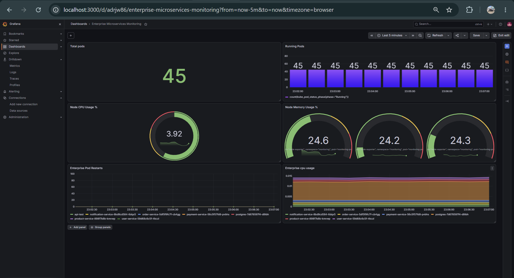
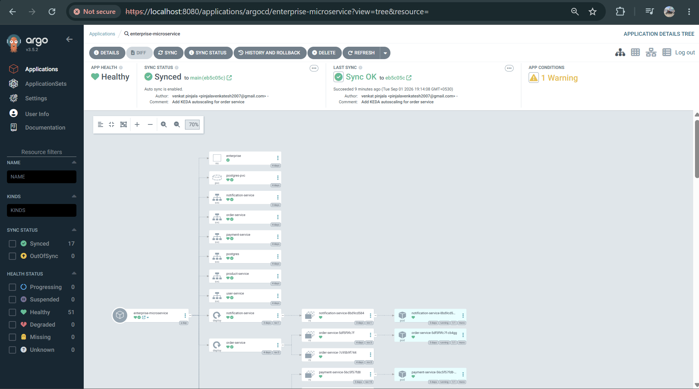
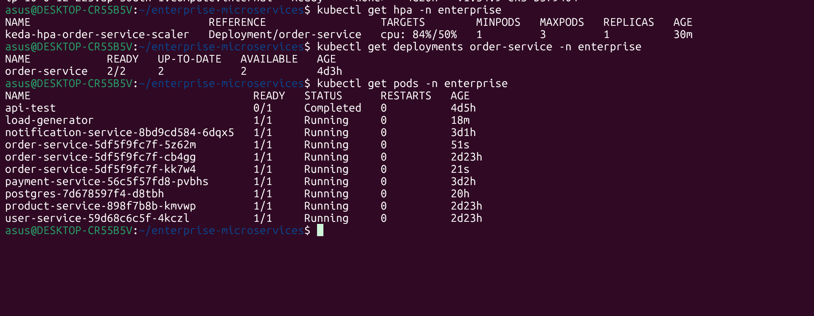
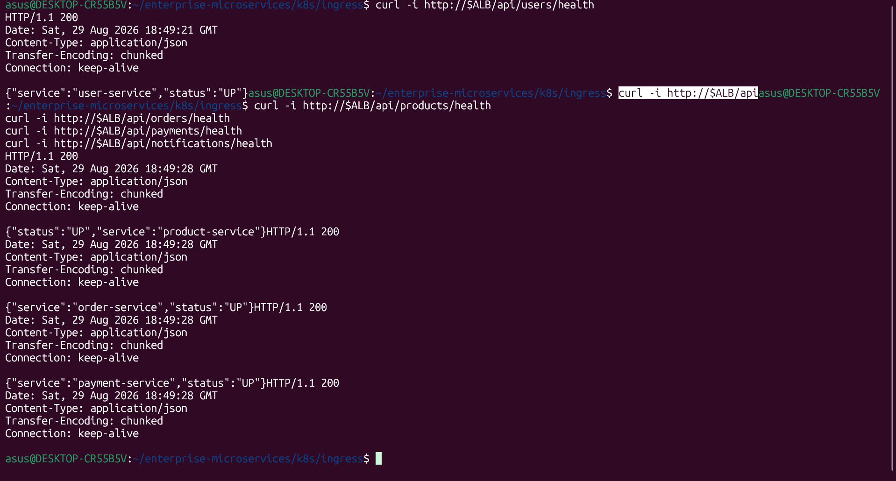

# 🚀 Enterprise Microservices DevOps Platform on AWS EKS

> An end-to-end cloud-native DevOps platform demonstrating CI/CD, containerization, Kubernetes, GitOps, security, policy enforcement, autoscaling, observability, and production-style troubleshooting.

---

### 🧭 Documentation Navigation

- [Project Overview](#-1-project-overview)
- [Platform at a Glance](#-platform-at-a-glance)
- [Complete Architecture](#️-2-complete-architecture)
- [Technology Stack](#-4-technology-stack)
- [AWS Infrastructure](#️-6-aws-infrastructure)
- [CI/CD](#-10-cicd-with-github-actions)
- [Kubernetes](#️-14-kubernetes-deployment)
- [Argo CD GitOps](#-17-argo-cd-gitops)
- [Kyverno](#-19-kyverno-policy-enforcement)
- [KEDA + HPA](#-20-keda--hpa-autoscaling)
- [Prometheus + Grafana](#-22-prometheus-monitoring)
- [Screenshots & Evidence](#-27-screenshots--clickable-evidence)
- [Real-World Issues](#-28-major-real-world-issues-troubleshot)
- [Security Practices](#-30-security-practices)
- [Final Validation](#-31-final-validation-checklist)
- [Resume Description](#-33-resume-project-description)

---

# 📌 1. Project Overview

This project implements an **Enterprise Microservices DevOps Platform** deployed on **Amazon EKS**.

The application consists of five Spring Boot microservices backed by PostgreSQL. The platform demonstrates the complete DevOps lifecycle:

```text
Source Code
    ↓
GitHub
    ↓
GitHub Actions
    ↓
Maven Build & Test
    ↓
SonarQube
    ↓
Trivy Security Scan
    ↓
Docker Build
    ↓
Docker Hub
    ↓
Argo CD GitOps
    ↓
Amazon EKS
    ↓
AWS ALB / Ingress
    ↓
Microservices
    ↓
PostgreSQL
```

The Kubernetes platform additionally includes:

```text
Kyverno       → Policy Enforcement
KEDA + HPA    → Autoscaling
Prometheus    → Metrics Collection
Grafana       → Visualization
```

---

## 🌟 Platform at a Glance

| Capability | Implementation |
|---|---|
| ☁️ Cloud | AWS |
| 🏗️ Infrastructure as Code | Terraform |
| ☸️ Kubernetes | Amazon EKS |
| 🧩 Application | 5 Spring Boot microservices |
| 🐳 Containers | Docker |
| 🔄 CI/CD | GitHub Actions |
| 🔍 Code Quality | SonarQube |
| 🛡️ Security Scanning | Trivy |
| 📦 Image Registry | Docker Hub |
| 🚀 GitOps | Argo CD |
| 🔐 Policy as Code | Kyverno |
| 📈 Autoscaling | KEDA + HPA |
| 📊 Metrics | Prometheus |
| 📉 Visualization | Grafana |
| 🗄️ Database | PostgreSQL |
| 🌐 Ingress | AWS ALB / Kubernetes Ingress |

### What makes this project production-oriented?

- **Reproducible infrastructure** through Terraform.
- **Automated delivery** through GitHub Actions and Docker images.
- **Git-driven deployment** through Argo CD reconciliation.
- **Security and quality gates** through SonarQube and Trivy.
- **Kubernetes governance** through Kyverno policy-as-code.
- **Tested elasticity** through KEDA/HPA under CPU load.
- **Operational visibility** through Prometheus and Grafana.
- **Real incident troubleshooting** across AWS networking, Kubernetes DNS, policy enforcement, GitOps, and metrics.

---

# 🏗️ 2. Complete Architecture

```text
                           ┌─────────────────────┐
                           │      DEVELOPER      │
                           └──────────┬──────────┘
                                      │
                                      ▼
                           ┌─────────────────────┐
                           │       GITHUB        │
                           │   Source Repository │
                           └──────────┬──────────┘
                                      │
                                      ▼
                    ┌────────────────────────────────┐
                    │        GITHUB ACTIONS           │
                    │             CI/CD               │
                    └───────────────┬────────────────┘
                                    │
                    ┌───────────────┼────────────────┐
                    │               │                │
                    ▼               ▼                ▼
                 Maven          SonarQube          Trivy
               Build/Test       Code Quality       Security
                    │               │                │
                    └───────────────┼────────────────┘
                                    │
                                    ▼
                           ┌─────────────────────┐
                           │    Docker Build     │
                           └──────────┬──────────┘
                                      │
                                      ▼
                           ┌─────────────────────┐
                           │     Docker Hub      │
                           │   Image Registry    │
                           └──────────┬──────────┘
                                      │
                                      ▼
                           ┌─────────────────────┐
                           │       ARGO CD       │
                           │       GitOps        │
                           └──────────┬──────────┘
                                      │
                                      ▼
                    ┌─────────────────────────────────┐
                    │           AMAZON EKS             │
                    │       Kubernetes Cluster        │
                    │                                 │
                    │  ┌─────────┐   ┌─────────────┐ │
                    │  │ Kyverno │   │ KEDA + HPA  │ │
                    │  └─────────┘   └─────────────┘ │
                    │                                 │
                    │  ┌────────────┐ ┌────────────┐ │
                    │  │ Prometheus │ │  Grafana   │ │
                    │  └────────────┘ └────────────┘ │
                    └──────────────┬──────────────────┘
                                   │
                                   ▼
                         ┌─────────────────────┐
                         │ AWS ALB / INGRESS   │
                         └──────────┬──────────┘
                                    │
             ┌──────────────────────┼──────────────────────┐
             │          │           │          │           │
             ▼          ▼           ▼          ▼           ▼
          User       Product      Order      Payment   Notification
         Service     Service     Service     Service      Service
           8081        8082        8083        8084         8085
             │          │           │          │           │
             └──────────┴───────────┴──────────┴───────────┘
                                    │
                                    ▼
                             ┌─────────────┐
                             │ PostgreSQL  │
                             │    5432     │
                             └─────────────┘
```

---

# 🎯 3. Project Objectives

- Provision AWS infrastructure using Terraform
- Deploy a multi-service Spring Boot application
- Containerize services using Docker
- Automate CI/CD using GitHub Actions
- Build applications using Maven
- Perform static code analysis using SonarQube
- Scan images/dependencies using Trivy
- Publish images to Docker Hub
- Deploy Kubernetes workloads to Amazon EKS
- Expose services through AWS ALB / Ingress
- Implement GitOps with Argo CD
- Enforce Kubernetes policies with Kyverno
- Implement autoscaling with KEDA and HPA
- Monitor workloads with Prometheus
- Visualize metrics with Grafana
- Perform end-to-end application validation
- Troubleshoot real AWS and Kubernetes failures

---

# 🧰 4. Technology Stack

| Area | Technology |
|---|---|
| Cloud | AWS |
| Kubernetes | Amazon EKS |
| IaC | Terraform |
| Application | Spring Boot |
| Build | Maven |
| Containers | Docker |
| Registry | Docker Hub |
| CI/CD | GitHub Actions |
| Code Quality | SonarQube |
| Security | Trivy |
| GitOps | Argo CD |
| Policy | Kyverno |
| Autoscaling | KEDA + HPA |
| Metrics | Prometheus |
| Dashboards | Grafana |
| Database | PostgreSQL |
| Version Control | Git / GitHub |
| OS / CLI | Linux, AWS CLI, kubectl |

---

# 📂 5. Repository Structure

```text
enterprise-microservices/
│
├── .github/
│   └── workflows/
│       └── microservices-ci.yml
│
├── user-service/
│   ├── src/
│   ├── pom.xml
│   └── Dockerfile
│
├── product-service/
│   ├── src/
│   ├── pom.xml
│   └── Dockerfile
│
├── order-service/
│   ├── src/
│   ├── pom.xml
│   └── Dockerfile
│
├── payment-service/
│   ├── src/
│   ├── pom.xml
│   └── Dockerfile
│
├── notification-service/
│   ├── src/
│   ├── pom.xml
│   └── Dockerfile
│
├── k8s/
│   ├── database/
│   ├── deployments/
│   ├── services/
│   ├── ingress/
│   ├── keda/
│   ├── policies/
│   └── storageclass-gp3.yaml
│
├── terraform/
│   ├── main.tf
│   ├── variables.tf
│   ├── outputs.tf
│   └── ...
│
└── README.md
```

---

# ☁️ 6. AWS Infrastructure

The AWS environment was provisioned using Terraform.

### Main infrastructure

- VPC
- Public and private subnets
- Internet Gateway
- NAT Gateway
- Route tables
- Security groups
- IAM roles and policies
- Amazon EKS cluster
- EKS managed node group
- AWS Load Balancer integration
- EBS-backed persistent storage

### AWS Region

```text
ap-south-1
```

### EKS Cluster

```text
enterprise-eks
```

---

# 🏗️ 7. Terraform Infrastructure as Code

Terraform is used to create and manage the AWS infrastructure as code.

### Workflow

```bash
cd terraform

terraform init
terraform validate
terraform plan
terraform apply
```

### Verify EKS

```bash
aws eks describe-cluster \
  --name enterprise-eks \
  --region ap-south-1
```

### Configure kubectl

```bash
aws eks update-kubeconfig \
  --region ap-south-1 \
  --name enterprise-eks
```

### Verify nodes

```bash
kubectl get nodes
```

---

# 🧩 8. Application Microservices

The platform contains five independent Spring Boot services.

| Service | Port | Responsibility |
|---|---:|---|
| User Service | 8081 | User management |
| Product Service | 8082 | Product management |
| Order Service | 8083 | Order processing |
| Payment Service | 8084 | Payment processing |
| Notification Service | 8085 | Notifications |

Each service contains its own:

- Source code
- Maven configuration
- Dockerfile
- Kubernetes deployment
- Kubernetes service

---

# 🐳 9. Docker Containerization

Each microservice is packaged as an independent Docker image.

Example:

```bash
docker build -t user-service:1.0.0 ./user-service
docker build -t product-service:1.0.0 ./product-service
docker build -t order-service:1.0.0 ./order-service
docker build -t payment-service:1.0.0 ./payment-service
docker build -t notification-service:1.0.0 ./notification-service
```

Images are published to Docker Hub and consumed by Kubernetes.

---

# 🔄 10. CI/CD with GitHub Actions

GitHub Actions automates the CI pipeline.

```text
Git Push
   ↓
GitHub Actions
   ↓
Checkout
   ↓
Maven Build / Test
   ↓
SonarQube Analysis
   ↓
Trivy Scan
   ↓
Docker Build
   ↓
Docker Push
```

This provides repeatable and automated application delivery.

---

# 🔨 11. Maven Build

Maven is used to compile, test, and package the Spring Boot services.

```bash
mvn clean package
```

The generated JAR is used to build the corresponding Docker image.

---

# 🔍 12. SonarQube Code Quality

SonarQube is used for static code analysis.

It helps identify:

- Bugs
- Code smells
- Vulnerability indicators
- Maintainability issues
- Code quality problems

Example:

```bash
mvn clean verify sonar:sonar
```

SonarQube analysis is part of the development/CI quality process.

---

# 🛡️ 13. Trivy Security Scanning

Trivy is used to scan container images and dependencies for known vulnerabilities.

Example:

```bash
trivy image user-service:1.0.0
```

The same scanning process is applied to the other service images.

Security scanning is performed before the application is promoted to deployment.

---

# ☸️ 14. Kubernetes Deployment

The application workloads run in the Kubernetes namespace:

```text
enterprise
```

### Verify workloads

```bash
kubectl get pods -n enterprise
```

```bash
kubectl get svc -n enterprise
```

```bash
kubectl get ingress -n enterprise
```

The namespace contains:

- Microservice Deployments
- Kubernetes Services
- PostgreSQL
- Persistent storage
- Ingress configuration
- KEDA configuration

---

# 🗄️ 15. PostgreSQL and Persistent Storage

PostgreSQL is deployed inside Kubernetes.

```text
PostgreSQL
Port: 5432
Namespace: enterprise
```

Persistent storage is provided using Kubernetes PVC/PV with AWS EBS-backed `gp3` storage.

### Check PostgreSQL

```bash
kubectl get pods -n enterprise | grep postgres
```

### Check PVC

```bash
kubectl get pvc -n enterprise
```

---

# 🌐 16. AWS ALB / Kubernetes Ingress

External application traffic enters through the AWS Application Load Balancer.

```text
Internet
   ↓
AWS ALB
   ↓
Kubernetes Ingress
   ↓
Microservices
   ↓
PostgreSQL
```

### Verify Ingress

```bash
kubectl get ingress -n enterprise
```

```bash
kubectl describe ingress -n enterprise
```

The Ingress resource controls routing to the configured microservices.

---

# 🚀 17. Argo CD GitOps

Argo CD continuously reconciles Kubernetes resources from Git.

```text
GitHub Repository
       ↓
     Argo CD
       ↓
   Amazon EKS
       ↓
Kubernetes Resources
```

### Argo CD Application

```text
enterprise-microservice
```

### Repository

```text
enterprise-microservices
```

### Manifest directory

```text
k8s/
```

### Verify

```bash
kubectl get applications -n argocd
```

```bash
kubectl get application enterprise-microservice -n argocd
```

Automated synchronization, pruning, and self-healing were configured.

---

# 🔁 18. Argo CD Self-Healing

Self-healing was verified by introducing configuration drift and confirming that Argo CD reconciled the Kubernetes state with the Git-defined desired state.

```text
Git Desired State
       ↓
     Argo CD
       ↓
Kubernetes State
       ↓
   Drift Detected
       ↓
Automatic Reconciliation
```

**Result:** Self-healing verification completed successfully.

---

# 🔐 19. Kyverno Policy Enforcement

Kyverno is used for Kubernetes policy enforcement.

A resource policy requires workloads in the `enterprise` namespace to define CPU and memory requests and limits.

Example:

```yaml
resources:
  requests:
    cpu: "100m"
    memory: "128Mi"
  limits:
    cpu: "500m"
    memory: "512Mi"
```

### Verify Kyverno

```bash
kubectl get pods -n kyverno
```

```bash
kubectl get clusterpolicy
```

```bash
kubectl describe clusterpolicy require-resource-limits
```

---

# 📈 20. KEDA + HPA Autoscaling

KEDA was configured for the `order-service`.

```text
Minimum replicas: 1
Maximum replicas: 3
CPU target: 50%
```

Architecture:

```text
Application Load
      ↓
CPU Metrics
      ↓
     KEDA
      ↓
      HPA
      ↓
Order Service
      ↓
1 → 2 → 3 Pods
```

### Verify KEDA

```bash
kubectl get scaledobjects -n enterprise
```

### Verify HPA

```bash
kubectl get hpa -n enterprise
```

### Verify pods

```bash
kubectl get pods -n enterprise -l app=order-service
```

---

# 🔥 21. KEDA Scale-Up / Scale-Down Validation

A temporary workload was used to generate CPU load.

Observed behavior:

```text
Normal
  ↓
1 Pod
  ↓
CPU Load
  ↓
2 Pods
  ↓
Higher Load
  ↓
3 Pods
  ↓
Load Removed
  ↓
Scale Down
```

HPA metrics were inspected during the test.

```bash
kubectl get hpa -n enterprise
```

```bash
kubectl top pods -n enterprise
```

**Result:** KEDA scale-up and scale-down verification completed successfully.

---

# 📊 22. Prometheus Monitoring

Prometheus was deployed using the `kube-prometheus-stack`.

Prometheus collects Kubernetes and infrastructure metrics including:

- Pod information
- CPU usage
- Memory usage
- Container metrics
- Node metrics
- Kubernetes workload metrics

### Verify monitoring

```bash
kubectl get pods -n monitoring
```

```bash
kubectl get prometheus -n monitoring
```

---

# 📈 23. Grafana Dashboards

Grafana uses Prometheus as its metrics data source.

The dashboard was verified with panels for:

- Total Pods
- Running Pods
- CPU Usage
- Memory Usage
- Pod Restarts
- CPU by Namespace
- Kubernetes workload metrics

Architecture:

```text
Kubernetes
    ↓
Prometheus
    ↓
Grafana
    ↓
Dashboards
```

**Result:** Prometheus and Grafana dashboard verification completed successfully.

---

# 🧪 24. End-to-End Application Validation

The final application flow was tested after the platform components were deployed.

```text
Client
  ↓
AWS ALB
  ↓
Ingress
  ↓
Microservices
  ↓
PostgreSQL
```

Validation commands:

```bash
kubectl get pods -n enterprise
kubectl get svc -n enterprise
kubectl get ingress -n enterprise
```

Application functionality, Kubernetes workloads, ingress routing, database connectivity, autoscaling, GitOps reconciliation, and monitoring were verified during the project.

**Result:** End-to-end application testing completed successfully.

---

# 🐛 25. Major Troubleshooting and Issues Resolved

This project involved real-world troubleshooting rather than only a successful deployment path.

## Issue 1 — EKS Node Creation Failure

### Problem

The EKS managed node group initially failed to create healthy worker nodes.

### Investigation

The following areas were checked:

- VPC configuration
- Private/public subnets
- Route tables
- NAT connectivity
- Security groups
- IAM permissions
- EKS node group configuration
- EC2/node networking

### Useful commands

```bash
aws eks describe-cluster \
  --name enterprise-eks \
  --region ap-south-1
```

```bash
aws eks describe-nodegroup \
  --cluster-name enterprise-eks \
  --nodegroup-name <nodegroup-name> \
  --region ap-south-1
```

The infrastructure and node configuration were corrected and the cluster was brought to a working state.

---

## Issue 2 — Kubernetes DNS / CoreDNS Connectivity

### Problem

Pods experienced Kubernetes DNS resolution failures.

A DNS test such as:

```bash
nslookup kubernetes.default.svc.cluster.local
```

experienced timeout behavior during troubleshooting.

### Investigation

The following components were investigated:

```text
Pod
 ↓
kube-dns Service
 ↓
kube-proxy / iptables
 ↓
CoreDNS
```

Commands:

```bash
kubectl get pods -n kube-system
```

```bash
kubectl get svc kube-dns -n kube-system
```

```bash
kubectl logs -n kube-system <coredns-pod>
```

Network connectivity, DNS service routing, CoreDNS, and kube-proxy behavior were investigated until service discovery was functioning correctly.

---

## Issue 3 — Kyverno Policy Blocking PostgreSQL

### Problem

After enabling the resource-limit policy, PostgreSQL did not initially satisfy the required CPU and memory requests/limits.

The Kyverno policy therefore rejected the workload configuration.

### Resolution

Resource requests and limits were added:

```yaml
resources:
  requests:
    cpu: "100m"
    memory: "128Mi"
  limits:
    cpu: "500m"
    memory: "512Mi"
```

After the manifest was corrected and synchronized through GitOps, PostgreSQL returned to the expected state.

---

## Issue 4 — Argo CD Duplicate StorageClass

### Problem

Argo CD reported a repeated resource warning for the `gp3` StorageClass.

The same StorageClass had been declared in more than one Kubernetes manifest.

### Investigation

```bash
grep -Rni "kind: StorageClass" k8s/
```

The duplicate declaration was identified and removed.

Argo CD then synchronized the desired Git state successfully.

---

# 🔧 26. Useful Troubleshooting Commands

### Kubernetes

```bash
kubectl get nodes
kubectl get pods -A
kubectl get svc -A
kubectl get events -n enterprise --sort-by=.lastTimestamp
```

### Resource Usage

```bash
kubectl top nodes
kubectl top pods -n enterprise
```

### KEDA / HPA

```bash
kubectl get scaledobjects -n enterprise
kubectl get hpa -n enterprise
kubectl describe hpa -n enterprise
```

### Argo CD

```bash
kubectl get applications -n argocd
kubectl describe application enterprise-microservice -n argocd
```

### Kyverno

```bash
kubectl get clusterpolicy
kubectl get pods -n kyverno
```

### Monitoring

```bash
kubectl get pods -n monitoring
kubectl get prometheus -n monitoring
```

---

# 📸 27. Screenshots & Clickable Evidence

All visual evidence is organized under `docs/screenshots/`.

> **Click any screenshot link to open the full-resolution image on GitHub.**
> The featured images are also clickable.

## ☁️ AWS / EKS

| Evidence | Screenshot |
|---|---|
| Kubernetes workloads | [**View Screenshot →**](docs/screenshots/eks-workloads.png) |

## 🔄 CI/CD & Security

| Evidence | Screenshot |
|---|---|
| GitHub Actions pipeline | [**View Screenshot →**](docs/screenshots/github-actions.png) |
| SonarQube analysis | [**View Screenshot →**](docs/screenshots/sonarqube.png) |
| Trivy security scan | [**View Screenshot →**](docs/screenshots/trivy.png) |
| Docker Hub images | [**View Screenshot →**](docs/screenshots/docker-hub.png) |

## 🚀 GitOps & Kubernetes Governance

| Evidence | Screenshot |
|---|---|

| Argo CD self-healing | [**View Screenshot →**](docs/screenshots/argocd-self-healing.png) |


## 📈 Autoscaling

| Evidence | Screenshot |
|---|---|
| KEDA scale-up: 1 → 2 → 3 | [**View Screenshot →**](docs/screenshots/keda-scale-up.png) |


## 📊 Observability

| Evidence | Screenshot |
|---|---|
| Prometheus | [**View Screenshot →**](docs/screenshots/prometheus.png) |
| Grafana dashboard | [**View Screenshot →**](docs/screenshots/grafana-dashboard.png) |

## 🧪 Application Validation

| Evidence | Screenshot |
|---|---|
| Final end-to-end validation | [**View Screenshot →**](docs/screenshots/end-to-end-test.png) |

## ⭐ Featured Evidence

### 📊 Grafana Dashboard
[](docs/screenshots/grafana-dashboard.png)

### 🚀 Argo CD Self-Healing
[](docs/screenshots/argocd-self-healing.png)

### 📈 KEDA Scale-Up
[](docs/screenshots/keda-scale-up.png)

### 🧪 End-to-End Test
[](docs/screenshots/end-to-end-test.png)

## 📂 Required Screenshot Layout

```text
enterprise-microservices/
│
├── README.md
│
└── docs/
    └── screenshots/
        ├── aws-eks-cluster.png
        ├── eks-workloads.png
        ├── github-actions.png
        ├── sonarqube.png
        ├── trivy.png
        ├── docker-hub.png
        ├── argocd-application.png
        ├── argocd-self-healing.png
        ├── kyverno.png
        ├── keda-scaledobject.png
        ├── keda-scale-up.png
        ├── keda-scale-down.png
        ├── prometheus.png
        ├── grafana-dashboard.png
        └── end-to-end-test.png
```

> **Important:** use these exact filenames so every README link resolves correctly.

# 🐛 28. Major Real-World Issues Troubleshot

This project was not completed only through the happy path. Several real AWS, Kubernetes, networking, policy, and observability issues were investigated and resolved.

## 🔴 Issue 1 — EKS Managed Node Group Creation Failure

### Symptom

The EKS managed node group initially failed to create healthy worker nodes.

### What was investigated

```text
EKS
 │
 ├── VPC
 ├── Subnets
 ├── Route Tables
 ├── NAT Gateway
 ├── Security Groups
 ├── IAM Roles / Policies
 └── EC2 Worker Nodes
```

### Troubleshooting

```bash
aws eks describe-cluster \
  --name enterprise-eks \
  --region ap-south-1
```

```bash
aws eks describe-nodegroup \
  --cluster-name enterprise-eks \
  --nodegroup-name <nodegroup-name> \
  --region ap-south-1
```

The VPC/network path, node configuration, IAM permissions, and security configuration were investigated until the worker-node environment became healthy.

### DevOps lesson

A Kubernetes cluster can be correctly defined at the control-plane level while worker nodes still fail because of AWS networking, IAM, or node bootstrap dependencies.

---

## 🔴 Issue 2 — Kubernetes DNS / CoreDNS Resolution Failure

### Symptom

Pods experienced DNS resolution problems.

A test such as:

```bash
nslookup kubernetes.default.svc.cluster.local
```

timed out during the incident.

### Investigation path

```text
Application Pod
      ↓
kube-dns Service
      ↓
ClusterIP
      ↓
kube-proxy / iptables
      ↓
CoreDNS Pod
```

The following were checked:

```bash
kubectl get pods -n kube-system
```

```bash
kubectl get svc kube-dns -n kube-system
```

```bash
kubectl logs -n kube-system <coredns-pod>
```

Service routing, CoreDNS, kube-proxy/iptables behavior, and pod-to-DNS connectivity were investigated.

### DevOps lesson

Kubernetes DNS depends on multiple layers. A running CoreDNS pod alone does not guarantee that application pods can resolve cluster services.

---

## 🔴 Issue 3 — Kyverno Policy Rejected PostgreSQL

### Symptom

After the Kyverno resource-limit policy was enabled, PostgreSQL did not initially contain the required CPU and memory requests/limits.

The policy therefore rejected the workload configuration.

### Policy requirement

```text
CPU request
CPU limit
Memory request
Memory limit
```

### Fix

The PostgreSQL manifest was updated:

```yaml
resources:
  requests:
    cpu: "100m"
    memory: "128Mi"
  limits:
    cpu: "500m"
    memory: "512Mi"
```

The corrected manifest was committed to Git and reconciled through Argo CD.

### DevOps lesson

Policy-as-code can intentionally block workloads. The correct response is to fix the manifest rather than bypassing the security policy.

---

## 🔴 Issue 4 — Argo CD OutOfSync / Duplicate gp3 StorageClass

### Symptom

Argo CD reported synchronization/resource warnings because the `gp3` StorageClass was declared more than once.

This created duplicate resource definitions in the Git-managed manifests.

### Investigation

```bash
grep -Rni "kind: StorageClass" k8s/
```

The duplicate `gp3` definition was identified in the Kubernetes repository.

### Fix

The duplicate StorageClass declaration was removed so that the resource had a single authoritative definition.

Argo CD was then allowed to reconcile the corrected Git state.

### Verification

```bash
kubectl get applications -n argocd
```

```bash
kubectl get application enterprise-microservice -n argocd
```

### DevOps lesson

GitOps requires Git to represent one clear desired state. Duplicate Kubernetes resources can create reconciliation warnings and make deployments difficult to reason about.

---

## 🔴 Issue 5 — Metrics Server Missing / KEDA Autoscaling Metrics Unavailable

### Symptom

KEDA/HPA autoscaling depended on Kubernetes resource metrics, but the Metrics Server was initially unavailable.

As a result, commands such as:

```bash
kubectl top pods -n enterprise
```

could not provide the required resource metrics during the initial troubleshooting stage.

### Investigation

The Metrics API was checked:

```bash
kubectl get apiservice v1beta1.metrics.k8s.io
```

The metrics pipeline was corrected and Metrics Server was installed/configured.

### Verification

```bash
kubectl get apiservice v1beta1.metrics.k8s.io
```

The API became available.

Then:

```bash
kubectl top pods -n enterprise
```

returned CPU and memory usage.

### Result

KEDA/HPA could then use CPU metrics and the `order-service` was successfully tested scaling:

```text
1 Pod
 ↓
2 Pods
 ↓
3 Pods
```

and scaling back down after the temporary load was removed.

### DevOps lesson

Autoscaling is dependent on a functioning metrics pipeline. KEDA/HPA configuration alone is not sufficient if Kubernetes resource metrics are unavailable.

---

# 🧭 29. Troubleshooting Method Used

A consistent troubleshooting approach was followed throughout the project:

```text
1. Identify the symptom
        ↓
2. Check Kubernetes/AWS status
        ↓
3. Inspect logs and events
        ↓
4. Test network / DNS / metrics
        ↓
5. Identify the failing layer
        ↓
6. Apply the smallest required fix
        ↓
7. Re-test
        ↓
8. Verify through GitOps / Kubernetes state
```

This approach was applied to:

- AWS infrastructure
- EKS worker nodes
- Kubernetes networking
- DNS
- Policy enforcement
- GitOps reconciliation
- Metrics
- Autoscaling

---

# 🔒 30. Security Practices

Security was considered across the development and deployment lifecycle.

Implemented practices include:

- IAM-based AWS access
- Kubernetes namespace isolation
- Kyverno policy enforcement
- Trivy scanning
- SonarQube analysis
- Container image scanning
- Kubernetes resource limits
- Git-based change tracking
- Keeping credentials outside source control

> Never commit AWS access keys, passwords, tokens, kubeconfig credentials, or database secrets to GitHub.

---

# ✅ 31. Final Validation Checklist

| Component | Status |
|---|---|
| AWS Infrastructure | ✅ |
| Terraform | ✅ |
| Amazon EKS | ✅ |
| Docker | ✅ |
| Docker Hub | ✅ |
| User Service | ✅ |
| Product Service | ✅ |
| Order Service | ✅ |
| Payment Service | ✅ |
| Notification Service | ✅ |
| PostgreSQL | ✅ |
| GitHub Actions | ✅ |
| Maven | ✅ |
| SonarQube | ✅ |
| Trivy | ✅ |
| Kubernetes | ✅ |
| AWS ALB / Ingress | ✅ |
| Argo CD | ✅ |
| Argo CD Self-Healing | ✅ |
| Kyverno | ✅ |
| Metrics Server | ✅ |
| KEDA | ✅ |
| KEDA Scale-Up | ✅ |
| KEDA Scale-Down | ✅ |
| Prometheus | ✅ |
| Grafana | ✅ |
| End-to-End Testing | ✅ |

---

# 🏆 32. Final Project Outcome

The completed platform demonstrates a complete DevOps lifecycle:

```text
                 ┌──────────────────┐
                 │      GitHub      │
                 └────────┬─────────┘
                          ↓
                 ┌──────────────────┐
                 │ GitHub Actions   │
                 └────────┬─────────┘
                          ↓
             ┌────────────┼────────────┐
             ↓            ↓            ↓
           Maven      SonarQube      Trivy
             └────────────┼────────────┘
                          ↓
                       Docker
                          ↓
                     Docker Hub
                          ↓
                       Argo CD
                          ↓
                      Amazon EKS
                          ↓
             ┌────────────┼────────────┐
             ↓            ↓            ↓
          Kyverno       KEDA       Prometheus
             │            │             ↓
             │            ↓          Grafana
             │          HPA
             ↓            ↓
             └────── Microservices
                          ↓
                      PostgreSQL
```

### Platform capabilities

- ☁️ Cloud infrastructure
- 🏗️ Infrastructure as Code
- 🔄 CI/CD automation
- 🐳 Containerization
- ☸️ Kubernetes orchestration
- 🚀 GitOps deployment
- 🔐 Security scanning
- 🔒 Policy enforcement
- 📈 Autoscaling
- 📊 Observability
- 🧪 End-to-end validation
- 🛠️ Real-world troubleshooting

---

# 👨‍💻 33. Resume Project Description

### Enterprise Microservices DevOps Platform on AWS EKS

Built an end-to-end microservices DevOps platform on Amazon EKS using Terraform, Docker, GitHub Actions, Argo CD, Kyverno, KEDA, Prometheus, and Grafana. Automated Maven builds, SonarQube analysis, Trivy security scanning, Docker image publishing, and GitOps-based Kubernetes deployments. Implemented AWS ALB Ingress, Kubernetes policy enforcement, KEDA-based autoscaling, and Prometheus/Grafana monitoring. Troubleshot real-world EKS networking, Kubernetes DNS, policy enforcement, and Argo CD synchronization issues.

---

# 📌 34. Resume Keywords

```text
AWS
Amazon EKS
Terraform
Docker
Kubernetes
GitHub Actions
CI/CD
Maven
SonarQube
Trivy
Argo CD
GitOps
Kyverno
KEDA
HPA
Prometheus
Grafana
PostgreSQL
AWS ALB
Ingress
Linux
Git
GitHub
```

---

# ⭐ 35. Project Status

```text
Enterprise Microservices DevOps Platform

Status: COMPLETED ✅

AWS Infrastructure      ✅
Terraform                ✅
Microservices            ✅
Docker                   ✅
CI/CD                    ✅
Security                 ✅
Kubernetes               ✅
ALB / Ingress             ✅
GitOps                    ✅
Policy Enforcement        ✅
Autoscaling               ✅
Monitoring                ✅
End-to-End Testing       ✅
Troubleshooting           ✅
```

---

# 🔮 35. Future Enhancements

The current implementation is complete for the demonstrated platform. These are intentionally planned **future production enhancements**:

### 📡 Datadog Observability
- Kubernetes, node, container and application monitoring
- Centralized logs
- APM and distributed tracing
- Dashboards, monitors and alerts
- SLO/SLI tracking

### 🔐 HashiCorp Vault
- Centralized secret management
- Kubernetes authentication
- Secure secret injection
- Secret rotation
- Least-privilege access
- GitOps integration without secrets stored in Git


> **Important:** Datadog and HashiCorp Vault are future enhancements and are not claimed as currently implemented.

---

# 📖 36. Project Summary

This project represents a complete, practical DevOps implementation rather than an isolated tool demonstration.

It combines:

```text
Terraform
   +
AWS EKS
   +
Docker
   +
GitHub Actions
   +
SonarQube
   +
Trivy
   +
Argo CD
   +
Kyverno
   +
KEDA
   +
Prometheus
   +
Grafana
   +
PostgreSQL
   =
Enterprise DevOps Platform
```

**Project Status: COMPLETED 🚀**


---

## 🎯 Why This Project Stands Out

This repository demonstrates more than simply deploying an application to Kubernetes. It covers the **full operational lifecycle**:

```text
Infrastructure
     ↓
Application Build
     ↓
Quality & Security Gates
     ↓
Container Registry
     ↓
GitOps Deployment
     ↓
Policy Enforcement
     ↓
Autoscaling
     ↓
Monitoring
     ↓
Incident Troubleshooting
     ↓
End-to-End Validation
```

The project combines **cloud infrastructure, CI/CD, containerization, Kubernetes, GitOps, security, policy-as-code, autoscaling, observability, and real-world troubleshooting** into one practical platform.

> **Project Status: COMPLETED 🚀**
